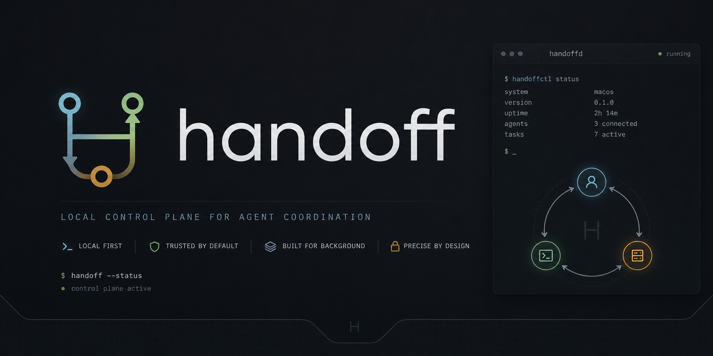

<p align="center">
  
</p>

<p align="center">
  
</p>

# handoff

`handoff` is a local control plane for AI coding agents.

It runs quietly in the background and:

- watches Claude Code, Codex, Copilot, Cursor, and Antigravity
- reads provider rate-limit headers from the local proxy
- keeps a shared project memory on disk
- hands work to the next agent before the active one stalls
- runs a worker/critic review loop for supervised implementation work

## `handoff init`

The normal setup flow is a single command:

```bash
brew install handsoff
cd your-project
handoff init
```

`handoff init` is the setup wizard. It:

1. starts the daemon in the background
2. starts the local proxy
3. detects installed agents
4. asks for the failover threshold
5. asks for the preferred agent chain
6. asks for worker and critic choices
7. writes unified memory and config
8. installs shell, Claude, and Codex hooks
9. keeps running silently after setup

After that, the normal workflow is just:

```bash
claude
codex
gh copilot
```

`handoff` watches and intervenes only when policy says it should.

## Runtime Model

```text
user works normally
    ↓
handoff watches usage
    ↓
threshold reached
    ↓
snapshot current state
    ↓
critic reviews
    ↓
next agent receives context
    ↓
work continues
```

## Per-Agent Support

| Agent | Detect | Context inject | Usage read | Headless spawn |
|---|---|---|---|---|
| Claude Code | `claude` binary; proxy: `api.anthropic.com` | `CLAUDE.md` | `anthropic-ratelimit-*` | `claude -p "<prompt>"` |
| Codex CLI | `codex` binary; proxy: `api.openai.com` | `AGENTS.md` | `x-ratelimit-*` | `codex exec "<prompt>"` |
| Copilot CLI | `gh copilot`; proxy: `api.githubcopilot.com` | `.github/copilot-instructions.md` | request counts only | `gh copilot suggest "<prompt>"` |
| Cursor / Antigravity | Electron binary | `.cursorrules` | best-effort via companion extension | not supported |

## Configuration

`handoff init` writes `.handoff/config.toml` with the project policy.

```toml
[failover]
threshold_percent = 15
chain = ["claude", "codex", "copilot"]
auto_switch = true
summarize = true

[review]
worker_agent = "claude-haiku"
lead_agent = "claude-opus"
passing_score = 8
max_rounds = 3

[memory]
mode = "unified"
auto_snapshot = true
```

## Command Surface

```text
handoff init [path]                         interactive setup wizard
handoff sync [path]                         brain.md → derived files
handoff agents                              live agent table
handoff discover                            scan running processes
handoff snapshot [--reason] [--json]        generate a project snapshot
handoff spawn <kind> [--no-proxy] -- ...    spawn an agent with proxy env
handoff attach <pid> --kind=<kind>          register an existing process
handoff handoff <to-kind> [--from N]        manual failover
handoff brain {cat|edit|append}             brain.md helpers
handoff critic run "<task>"                 one-shot worker + critic
handoff critic watch "<task>"               rerun on file changes
handoff daemon {run|start|stop|status}      admin: daemon lifecycle
handoff proxy {start|stop|status}           admin: proxy lifecycle
```

## Safety Boundaries

- The proxy logs response headers only, never request or response bodies.
- Snapshots stay local under `<project>/.handoff/scratch/`.
- Rate-limit samples are stored in `~/.handoff/state.db`.
- To remove local state: `rm -rf ~/.handoff && rm -rf <project>/.handoff`

## Build And Test

```bash
cd rust
cargo build --workspace --release
cargo test --workspace
```

Linux and macOS are supported. Windows is not a first-class target.
